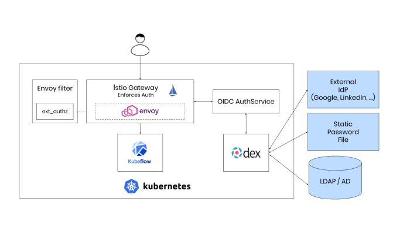
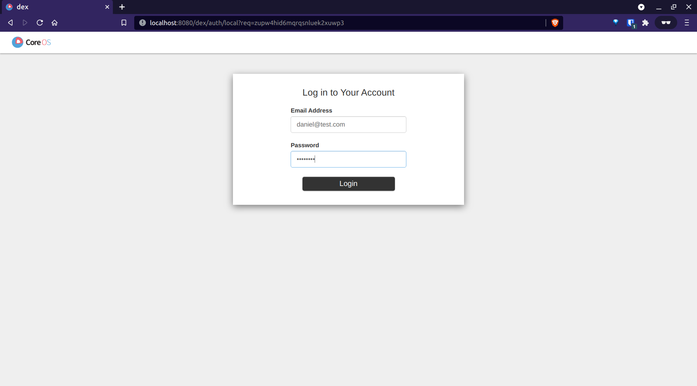
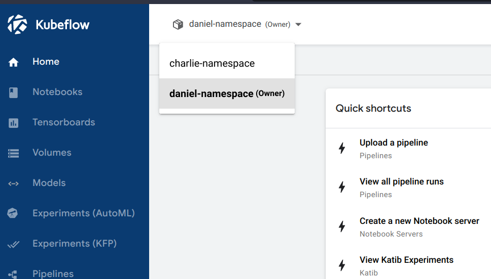
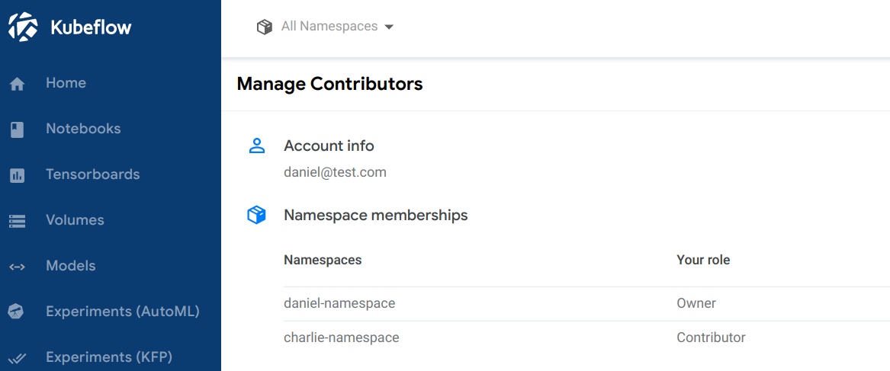

# Usage of Kubeflow on-premises multitenancy features

> Setup of Kubeflow for multitenancy usage on an on-premises system. Done as part of a practical project at the University of Applied Sciences (HKA)


[^1]

1. [General concepts](./general.md): General authentication and authorization concepts used in Kubeflow
2. [Authentication](./authentication.md): Authentication related concepts
3. [Authorization](./authorization.md): Authorization related concepts
4. `./manifests/`: Kubernetes manifests used in the examples

## Example

> Example of creating Profiles and adding contributors manually in Kubeflow

- **Requirements:** Install `minikube`, `kubectl`, `docker` and `kustomize`(Version `3.2.0`)
- All example files also are in `./manifests/`

### Setup

1. Start `minikube` cluster:

```bash
minikube start \
--driver=docker \
--disk-size=40g \
--kubernetes-version=1.19.16 \
--extra-config=apiserver.service-account-signing-key-file=/var/lib/minikube/certs/sa.key \
--extra-config=apiserver.service-account-issuer=kubernetes.default.svc
```

Refer to the [minikube documentation](https://minikube.sigs.k8s.io/docs/) for more details.

2. Clone Kubeflow manifests repository and use it: `git clone https://github.com/kubeflow/manifests.git && cd manifests`
3. Build Kubeflow components: `while ! kustomize build example | kubectl apply -f -; do echo "Retrying to apply resources"; sleep 10; done`

---

The current default user is `user@example.com` and the password `12341234`. For demonstration purposes, we will create new users and it's associated profiles.

#### Profile creation

In the following, we are going to create 3 new profiles for Daniel, Bob and Charlie:

```yaml
apiVersion: kubeflow.org/v1beta1
kind: Profile
metadata:
  name: daniel-namespace
spec:
  owner:
    kind: User
    name: daniel@test.com
---
apiVersion: kubeflow.org/v1beta1
kind: Profile
metadata:
  name: bob-namespace
spec:
  owner:
    kind: User
    name: bob@test.com
---
apiVersion: kubeflow.org/v1beta1
kind: Profile
metadata:
  name: charlie-namespace
spec:
  owner:
    kind: User
    name: charlie@test.com
```

Create profiles: ` kubectl create -f profiles.yaml`

#### Create user accounts in Dex

1. Get current configmap: `kubectl get configmap dex -n auth -o jsonpath='{.data.config\.yaml}' > dex-yaml.yaml`
2. Edit configmap to add new users:

```yaml
issuer: http://dex.auth.svc.cluster.local:5556/dex
storage:
  type: kubernetes
  config:
    inCluster: true
web:
  http: 0.0.0.0:5556
logger:
  level: "debug"
  format: text
oauth2:
  skipApprovalScreen: true
enablePasswordDB: true
staticPasswords:
  - email: user@example.com
    hash: $2y$12$4K/VkmDd1q1Orb3xAt82zu8gk7Ad6ReFR4LCP9UeYE90NLiN9Df72
    username: user
    userID: "15841185641784"
  - email: daniel@test.com
    hash: $2y$10$uFT3mTwg6D7kyv/vmvzeUOn1UR9GJRLHCH3c9D65j/pv4.YkbKeDW
    username: daniel
  - email: bob@test.com
    hash: $2y$10$qlHJyj2U9xNzBkg/DxS1e.0.xrq4QJgXx10tz55M1yEcOO7Q5hDZq
    username: bob
  - email: charlie@test.com
    hash: $2y$10$UrDSSMFVhrQJLwxw23cGHudySdp7BZcfESy7zi7upGQsx9cyK6ddy
    username: charlie
staticClients:
  - idEnv: OIDC_CLIENT_ID
    redirectURIs: ["/login/oidc"]
    name: "Dex Login Application"
    secretEnv: OIDC_CLIENT_SECRET
```

The password of each user is saved as it's respective hash. The hash can be generated for example with the `htpasswd` command:

```bash
htpasswd -bnBC 10 "" password | tr -d ':\n'
```

3. Create new configmap: `kubectl create configmap dex --from-file=config.yaml=dex-yaml.yaml -n auth --dry-run=client -o yaml | kubectl apply -f -`
4. Restart Dex to apply the changes: `kubectl rollout restart deployment dex -n auth`

#### Add contributors

As example, we will add _Daniel_ as contributor to the namespace of _Charlie_:

Create the `authorizationpolicy.yaml` and `rolebinding.yaml` files:

```yaml
apiVersion: security.istio.io/v1beta1
kind: AuthorizationPolicy
metadata:
  annotations:
    role: edit
    user: daniel@test.com
  name: user-daniel-test-com-clusterrole-edit
  namespace: charlie-namespace
spec:
  action: ALLOW
  rules:
    - when:
        - key: request.headers[kubeflow-userid]
          values:
            - daniel@test.com
```

```yaml
apiVersion: rbac.authorization.k8s.io/v1
kind: RoleBinding
metadata:
  annotations:
    role: edit
    user: daniel@test.com
  name: user-daniel-test-com-clusterrole-edit
  namespace: charlie-namespace
roleRef:
  apiGroup: rbac.authorization.k8s.io
  kind: ClusterRole
  name: kubeflow-edit
subjects:
  - apiGroup: rbac.authorization.k8s.io
    kind: User
    name: charlie@test.com
```

Create both resources:

```bash
kubectl create -f rolebinding.yaml
kubectl create -f authorizationpolicy.yaml
```

Now, it should be possible to login to the `daniel-namespace` and access the `charlie-namespace`:

1. Port forward Istio's Ingress-Gateway to local port 8080: `kubectl port-forward svc/istio-ingressgateway -n istio-system 8080:80`
2. Open your browser and visit http://localhost:8080
3. Login with `daniel@test.com` and the choosen password:



4. Access the `charlie-namespace`:

_Dropdown:_



<p></p>

_Contributor management:_



[^1]: https://journal.arrikto.com/kubeflow-authentication-with-istio-dex-5eafdfac4782
