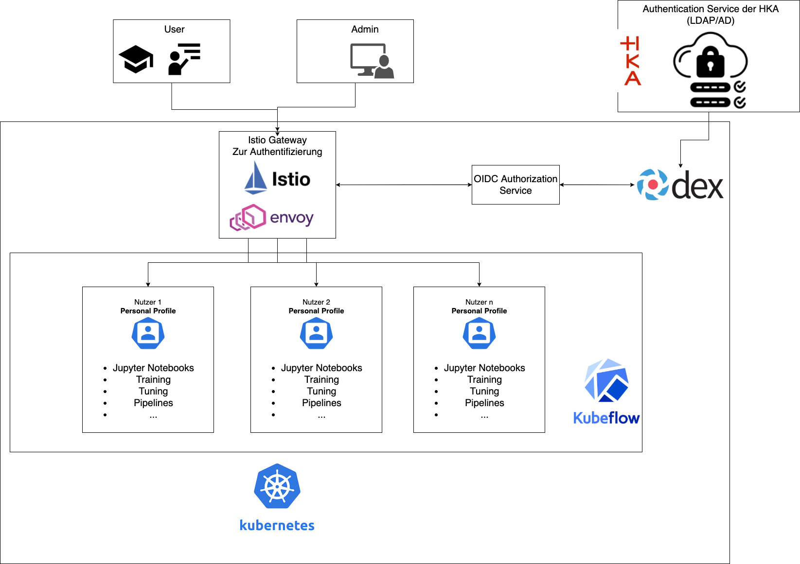

# Authentication model for an on-premises Kubeflow setup

Kubeflow uses different components to provide authentication:

1. **Istio** as ingress gateway
2. **OIDC** as identity layer

The starting point for the authentication is the Istio ingress gateway, which then uses an external authentication provider. This has the advantage of outsourcing all the authentication logic to an external provider and not having to deal with it in Kubeflow itself.  
The following two sections describe the OpenID Connect flow used in Kubeflow and the authentication providers more in detail.

## OpenID Connect flow

> The general authentication is based on the [OpenID Connect Protocol](https://openid.net/connect/)(OIDC).

The whole OIDC flow for Kubeflow uses the following components:

1. Istio gateway: Acts as ingress gateway. Allows or denies the request and acts only as control pane
2. Envoy: acts as OIDC client. Envoy does the actual authentication request for Istio. Uses [Filters](https://www.envoyproxy.io/docs/envoy/latest/configuration/http_filters/http_filters) to forward requests to the authorization service
   - A request get's either _Accepted, rejected or redirected_ by Envoy
3. Authorization service: Handles JWT logic of verifying the token. Example implementation to use: https://github.com/ajmyyra/ambassador-auth-oidc
4. [Dex](https://github.com/dexidp/dex): Acts as identity service. Is used to connect and use an external identity provider
5. [Authentication providers](#authentication-providers). Provides the actual authentication information.

Flow:

1. If JWT **needs to be requested** : 1-8(Outer rectangle):

In this case, a user is not authenticated. Therefore, the request gets forwarded to the respective authentication provider. If the credentials are correct, the user get's a JWT token it can use for further requests.

2. If the passed JWT just needs to be **verified**: 1-2-7-8(Inner rectangle):

In this case, a user is already authenticated. Therefore, the JWT only needs to be verified by the authorization service for it's legitimacy. If successful, the user can access it's Kubeflow profile.

```
 ┌────────────────────────────────────────────────────────────────────────────────────────────────────────┐
 │ ┌───────────────────────────────────────────┐                                                          │
 │ │                                           │                                                          │
 │ │  ┌─────────────┐                          │                                                          │
 │ │  │Istio gateway│                          │                                                          │
 │ │  └──────┬──────┘                          │                                                          │
 │ │         ▼ 1   ▲ 8  7                      │  6                       5                               │
 │ │  ┌────────────┴┐ ◄──┌─────────────────────│ ◄─┌────────────────┐ ◄───────┌────────────────────────┐  │
 │ │  │    Envoy    │    │Authorization service│   │Identity service│         │Authentication providers│  │
 │ │  └─────────────┘───►└─────────────────────│──►└────────────────┘────────►└────────────────────────┘  │
 │ │                  2                        │ 3                      4                                 │
 │ │                                           │ ▲                                                        │
 │ └───────────────────────────────────────────┘ │                                                        │
 │                                         Only needed, if JWT needs to be requested!                     │
 └────────────────────────────────────────────────────────────────────────────────────────────────────────┘

```

The following image shows the described components at a high level overview:



## Authentication providers

To use in the context of an On-Prem system, there are different possibilities regarding the provider:

1. Use **LDAP/AD** and **OpenID** connect:

- No authentication logic on our side
- No user management. For example deactivating account(Access) after leaving project.

2. Implement **simple authentication system**. Useful for _guests_.

- [Kratos](https://github.com/ory/kratos): "cloud native Identity and User Management System"
- Additional component
- Management overhead

## References

- https://journal.arrikto.com/kubeflow-authentication-with-istio-dex-5eafdfac4782?gi=a8acf1ab865e
- https://www.kubeflow.org/docs/components/multi-tenancy/
- OpenID Connect (OIDC): https://openid.net/connect/