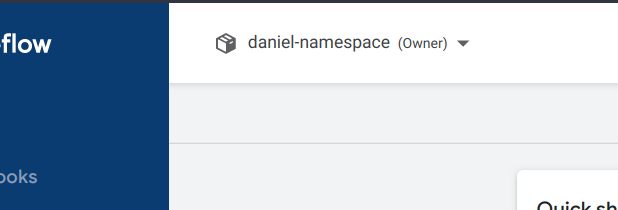
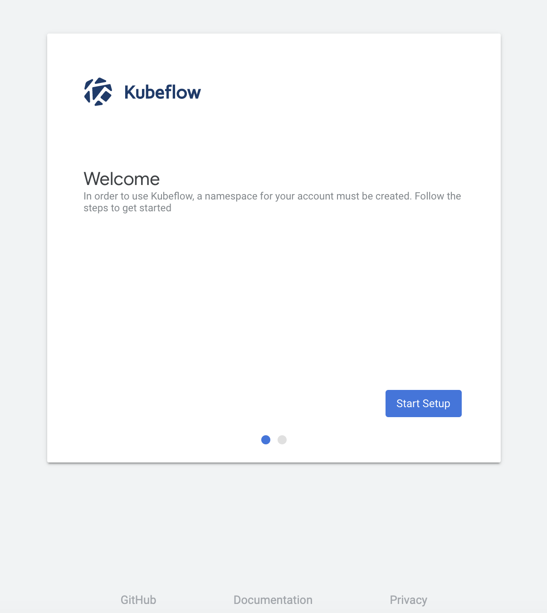
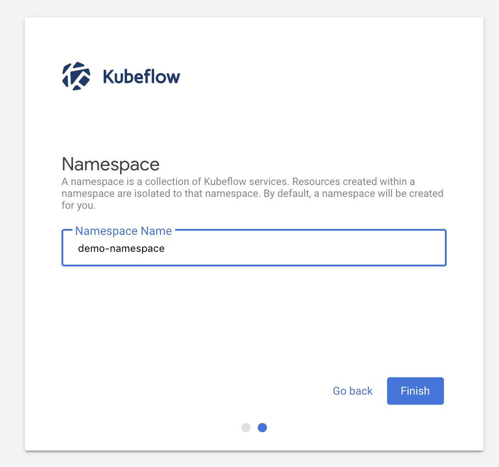
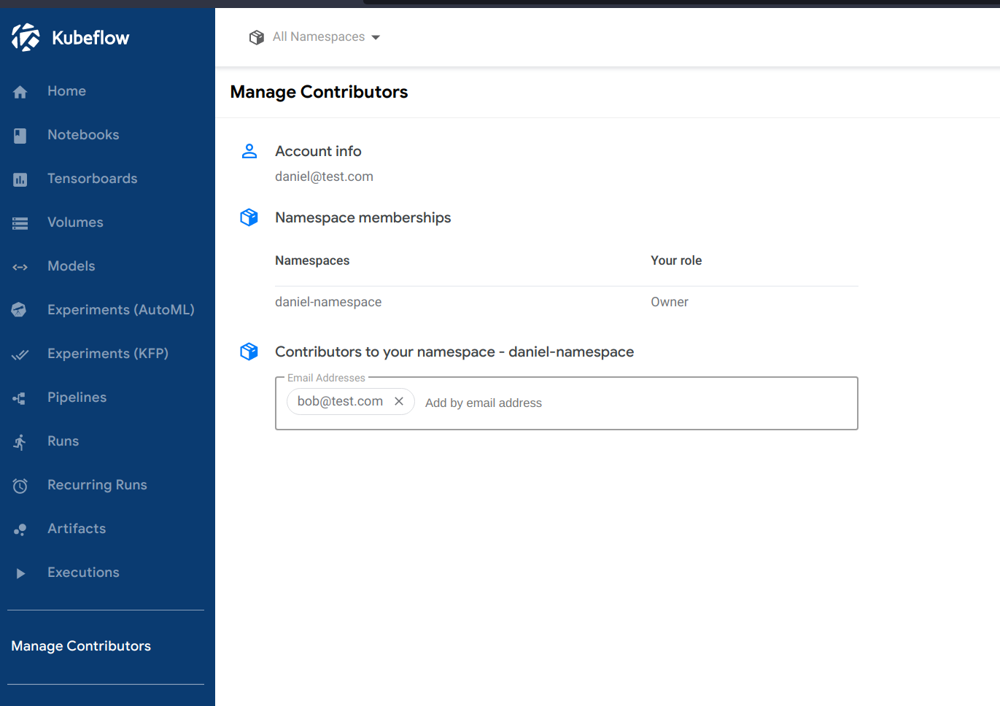
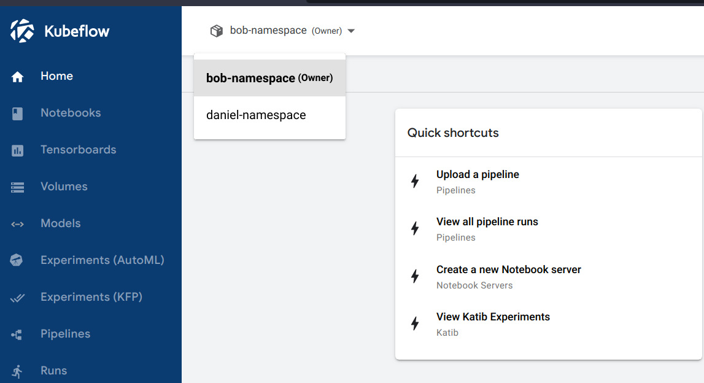
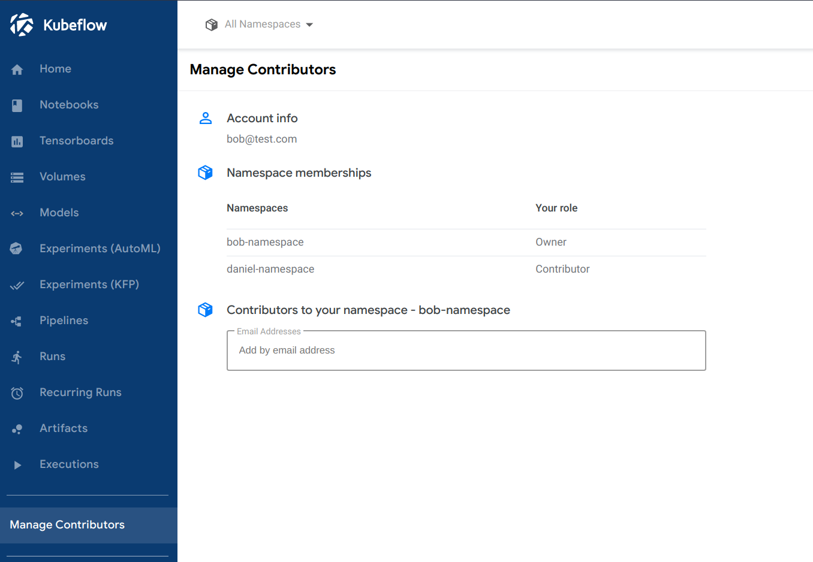

# General concepts

> General concepts that apply for [authorization](authorization.md) as well as for [authentication](authentication.md)

In Kubeflow there are **users** that own **resources** in a **namespace**. These users can share their namespace resources with other users. Through this concept, a **user** can belong to **multiple** namespaces which can be seen as _groups_. In this _groups_ users can work with the same resources. Resources can be components like jupiter notebooks or pipelines.

- [General concepts](#general-concepts)
  - [Kubeflow Profiles](#kubeflow-profiles)
    - [CRUD operations on users](#crud-operations-on-users)
      - [Create and Update](#create-and-update)
      - [Read](#read)
      - [Delete](#delete)
    - [Add contributors to Profile](#add-contributors-to-profile)
      - [Add contributors through the Kubeflow UI](#add-contributors-through-the-kubeflow-ui)
      - [Add contributors manually](#add-contributors-manually)
  - [References](#references)

In the following the concept of contributors and users is described in detail.

## Kubeflow Profiles



The User management in Kubeflow is based on Kubernetes [namespaces](https://kubernetes.io/docs/concepts/overview/working-with-objects/namespaces/). Those are also called _Profiles_ in Kubeflow and provide the basis for the use of multi-user isolation. Namespaces are created automatically by Kubeflow on the first setup or by the administrator for new users.  
As described above, a Profile is associated with a Namespace and resources like Jupiter notebooks or pipelines. There is also the possibility to share resources in a read-only or read-write way with other profiles.  
In Kubernetes itself, a profile is implemented as a [custom resource definition](https://kubernetes.io/docs/concepts/extend-kubernetes/api-extension/custom-resources/).

### CRUD operations on users

#### Create and Update

To add new users, Kubeflow provides two ways: An automatic way on the first login and a manual way executed by the administrator. An administrator is a person with the [cluster-admin](https://kubernetes.io/docs/reference/access-authn-authz/rbac/#user-facing-roles) RBAC role.

1. **Automatic profile generation**: The automatic profile generation get's triggered on the first login of the user when no namespace exists. This is the case, when an external authentication provider is used. For example with university accounts. The registration flow to create a new profile would look like the following [^1]:

| Welcome screen                       |  Select Namespace name               |
| ------------------------------------ | ------------------------------------ |
|  |  |

To be able to use the registration flow, set the `CD_REGISTRATION_FLOW` environment variable to ` true`. This environment variable can be found in the `apps/centraldashboard/upstream/base/configmap.yaml` file of the [manifests](https://github.com/kubeflow/manifests) repository:

```yaml
CD_REGISTRATION_FLOW=true
```

2. **Manual profile generation**:

As previously mentioned, the administrator can also manually manage users. To do this, it creates a profile resource or applies it to update a profile. It could for example be possible to manually create a main Profile and then add the different participants to it.
An example profile YAML manifest could look like this:

```yaml
apiVersion: kubeflow.org/v1beta1
kind: Profile
metadata:
  name: danielNamespace
spec:
  owner:
    kind: User
    name: daniel@test.com

  resourceQuotaSpec:
    hard:
      cpu: "2"
      memory: 2Gi
      requests.nvidia.com/gpu: "1"
      persistentvolumeclaims: "1"
      requests.storage: "5Gi"
```

In the above example a new user with the Profile name `danielNamespace` and it's respective mail is defined. Additionally, a resource quota for cpu, memory, gpu and storage is set. Note, that the definition of quotas is optional.

To finally create the resource, either ` create` or `apply` it with ` kubectl`:

```bash
kubectl create -f profile.yml # Create new profile resource
# or
kubectl apply -f profile.yml # Change profile values
```

To create or change multiple profiles at the same time, the same structure as above can be used. To separate each Profile, use `---` between them in the manifest:

```yaml
apiVersion: kubeflow.org/v1beta1
kind: Profile
metadata:
  name: danielNamespace
spec:
  owner:
    kind: User
    name: daniel@test.com
---
apiVersion: kubeflow.org/v1beta1
kind: Profile
metadata:
  name: bobNamespace
spec:
  owner:
    kind: User
    name: bob@test.com
```

Listing Kubeflow profiles through `kubectl` after creation:

```bash
➜ kubectl get profiles
NAME                        AGE
bob-namespace               91s # <-- Bob
daniel-namespace            39m # <-- Daniel
kubeflow-user-example-com   42m # <-- Default user
➜ kubectl get namespaces
NAME                        STATUS   AGE
auth                        Active   43m
bob-namespace               Active   94s # <-- Bob
cert-manager                Active   43m
daniel-namespace            Active   7m16s # <-- Daniel
default                     Active   45m
istio-system                Active   43m
knative-eventing            Active   43m
knative-serving             Active   43m
kube-node-lease             Active   45m
kube-public                 Active   45m
kube-system                 Active   45m
kubeflow                    Active   43m
kubeflow-user-example-com   Active   7m15s # Default user
kubernetes-dashboard        Active   30m
```

#### Read

To get information about a current user, the `get` and `describe` `kubectl` commands can be used:

```bash
kubectl get profiles # Get current profiles
# and with one profile in specific:
kubectl describe profile [PROFILE_NAME] # Get information about specific profile
```

NOTE: Profiles can only be read by the administrator

#### Delete

To delete the profile namespace and it's resources, use the ` kubectl` `delete` command:

```bash
# Delete specific profile.
# Refer to the read operations to get Profile name
kubectl delete profile [PROFILE_NAME]
```

NOTE: Profiles can only deleted by the administrator

### Add contributors to Profile

Kubeflow allows collaborative work by providing the ability to add contributors to it's own namespace. This can be done through the Kubeflow contributor UI or manually as an administrator.

#### Add contributors through the Kubeflow UI

To add users to a namespace, navigate to the `Manage Contributors` section. There, other users can be invited to the Namespace by using their mail.
In the UI you can also find information about the current profile and it's respective memberships.

Steps to add a new contributor from the UI:

1. In the Daniel namespace add Bob



2. In the Bob namespace, Bob gets access to Daniel his namespace:





#### Add contributors manually

To add contributors to a namespace, one [AuthorizationPolicy](https://istio.io/latest/docs/reference/config/security/authorization-policy/) and one [RoleBinding](https://kubernetes.io/docs/reference/access-authn-authz/rbac/#rolebinding-and-clusterrolebinding) manifest has to be created. The role binding defines the permissions a user will get in the namespace. The authorization policy defines the access control to the resources through Istio.

The `authorizationpolicy.yml`:

```yaml
apiVersion: security.istio.io/v1beta1
kind: AuthorizationPolicy
metadata:
  annotations:
    role: edit
    user: daniel@test.com
  name: user-daniel-test-com-clusterrole-edit
  namespace: bobNamespace
spec:
  action: ALLOW
  rules:
    - when:
        - key: request.headers[kubeflow-userid]
          values:
            - daniel@test.com
```

The `rolebinding.yaml`:

```yaml
apiVersion: rbac.authorization.k8s.io/v1
kind: RoleBinding
metadata:
  annotations:
    role: edit
    user: daniel@test.com
  name: user-daniel-test-com-clusterrole-edit
  namespace: bobNamespace
roleRef:
  apiGroup: rbac.authorization.k8s.io
  kind: ClusterRole
  name: kubeflow-edit
subjects:
  - apiGroup: rbac.authorization.k8s.io
    kind: User
    name: bob@test.com
```

An finally actually create the resources:

```bash
kubectl create -f rolebinding.yaml
kubectl create -f authorizationpolicy.yaml
```

In the above example, `daniel@test.com` got added to the `bob-namespace` as contributor and can view and modify resources on `bob-namespace`.

NOTE: Only the administrator can manage contributors manually

## References

- https://www.kubeflow.org/docs/components/multi-tenancy/overview/

[^1]: https://www.kubeflow.org/docs/components/multi-tenancy/getting-started/#automatic-creation-of-profiles
